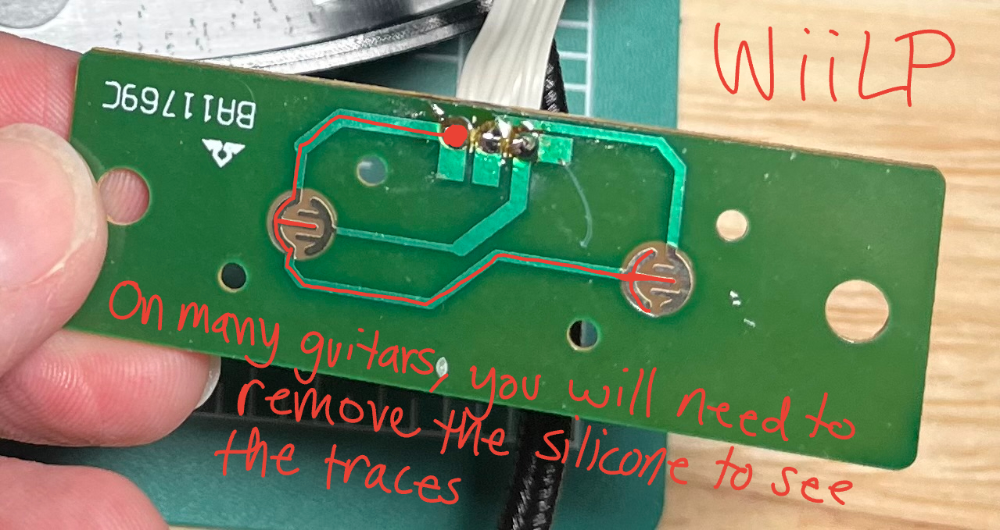
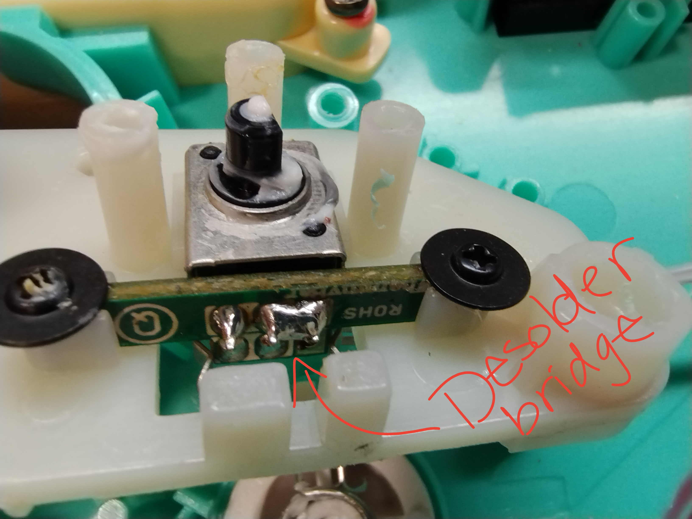
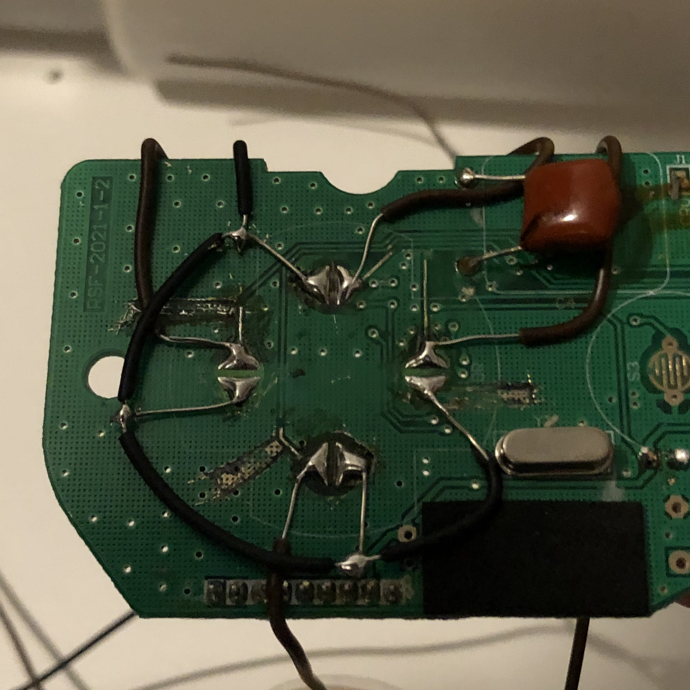
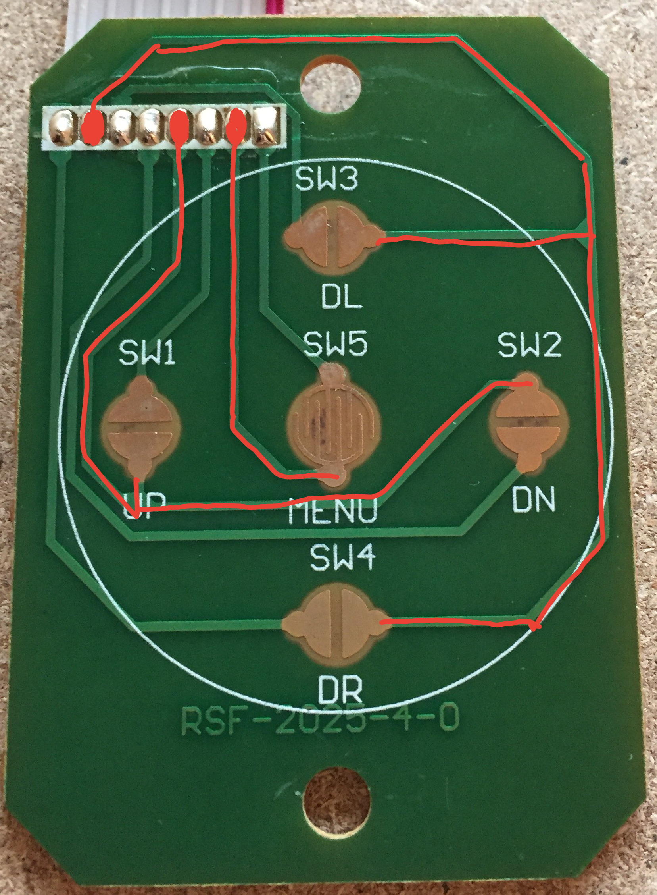

# Wiring a Guitar
## Before you start:
If you are new to this, read the [following guide](https://santroller.tangentmc.net/wiring_guides/general.html) for an overview on everything you need to know for modifying a controller.
If you want to use things like LEDs or peripherals or GH5 necks or GHWT necks, you will want to avoid the relevant pins when picking pins for things. Note that for the Pi Pico, you can configure these pins, so it is recommended you open the tool and use it to set up pins for these sorts of things, as only very specific pins can be used for this sort of thing. 

## Supplies
* A microcontroller from the list in the [following guide](https://santroller.tangentmc.net/wiring_guides/general.html)

* A Tilt Switch
  * The tool supports using basic digital tilt switches (somtimes called a mercury or ball tilt switch)
    * I recommend using two tilt sensors in series, as this can help with accidental activations
  * The tool also supports using analog tilt switches

  ```danger
  You do not want to get this type of sensor, as it does not work. If you do accidentally get one of these you *might* have luck just cutting the sensor from the top of the board and using it, but your mileage may vary doing that, as I have seen it work for some people and not for others.
        
  [{: width="250" }](../assets/images/s-l500.png)
  ```
* Some Wire
* Soldering Iron
* Multimeter (it will be used mainly in continuity mode, where it beeps when the two contacts are shorted together)
* Wire Strippers
* Wire Cutters
* Heatshrink

## The finished product
[{: width="250" }](../assets/images/direct.jpg)

## Wiring Steps
For every function of the guitar, you will follow these same 3 basic steps. More details for specific functions will be given below.
1. Find out what each pin correlates to on the exsisting components in the guitar. (AKA work out the pinout) In some guitars, all of the pins are labeled on the main board or other various pcbs, sometimes on the bottom of the main board. 
2. Cut the wires away from the main board as close to the PCB as you can, giving yourself the most amount of wire that you can get. You may find however that the wire isn't long enough, in this case you can either join some more wire onto the end of the existing wires or you can desolder the cables and replace them.
3. Connect the wires to appropriate pins on the microcontroller. 

Once you have successfully modded one guitar (or even during your first) you will find it easiest to disconnect everything then begin soldering as it gives you more room to work. To keep the relevant information in this guide easy to find, information is sorted by function. 

## Start and Select

[{: width="250" }](../assets/images/360startselect.jpg)

[{: width="250" }](../assets/images/wiiLPstartselect.jpg)

1. If it is not labeled on the motherboard, you need to figure out which pin (or pins) is GND. If you remove the membrane, you will be able to see which pin connects to both start and select by following the traces - that pin is GND. (if there are multiple "grounds" they may be labeled as col, or column) Marking GND with a sharpie or using a differently colored wire is reccomended. If you are still unsure, the multimeter can help you confirm if you have the wires correct, as it will beep when you hit a button and have the correct wires. There are examples of the 360 WT and WiiLP above.
2. Connect the common ground to a GND on the microcontroller. If there are two ground wires, you can twist them together and put them in one ground pin on the microcontroller. This will sometimes be necessary when using a microcontroller that has a smaller number of pins.
3. Connect each button to an unused digital pin on the microcontroller. 

```note
To wire an xplorer start/select board you will have to solder directly to the contacts and cut the traces that connect to each contact. It is not recommended you try to mod an xplorer as your first project because this can be difficult.
Note that with the Pi Pico, you can instead just hook these inputs up over USB, and avoid soldering them.
```

## Whammy
1. With most whammy's there are 3 pins. (if there are 4, you do not need the fourth. 2 pins is discussed below) The middle pin is the data pin, one outer pin is VCC while the other pin is GND (it doesn't matter which one, you can flip it when programming later if needed). Whammy needs to go to an analogue pin.
2. Connect VCC and GND to the microcontroller. (the two outside wires)
   * If your whammy is not responding correctly in game, you may need to swap VCC and GND around.
3. Connect the data (middle) pin to an analogue pin on the microcontroller. These are labeled with an A on the microcontroller.

If you are working on a controller with only "2" pins as shown below, you will need to desolder the bridged pins and run 3 wires yourself as noted above for the whammy to work best with the configurator.

[{: width="250" }](../assets/images/2wirewhammy.jpg)

## Digital Tilt
1. Connect one pin of the first tilt sensor to ground
2. Connect the other pin of the first tilt sensor to a pin on the second tilt sensor
3. Connect the other pin of the second tilt sensor to a digital pin on your microcontroller.
4. Affix the sensors to your guitar. You will need to play around with their position to get them to activate at the exact point you want tilt activating.

## World tour slider bar (Pi Pico only)
The world tour slider bar originally used a single wire to connect between the bar and the main PCB. This caused a lot of problems, as the format of data being sent over this wire is not optimal for speed, and it limits the combinations of frets we can read from the slider bar. To combat this, we bypass the chip generating this data, and opt to build it outselves from the raw slider pads. This does use more pins though, so you may find that it is difficult to reuse the original neck connector. If you have problems doing this, you can use the [peripheral feature](https://santroller.tangentmc.net/tool/peripheral.html) to put a second Pi Pico in the neck, which will allow for putting all neck inputs over a couple of wires, saving pins.
1. Connect the following pins using the image below as a guide

   [{: height="250" }](../assets/images/wt_pins.png)
   1. Connect S0, S1 and S2 to seperate digital pins on the Pi Pico. You will need to solder directly to the chip on the PCB.
   2. Connect the analog pin to a analog pin on the Pi Pico.  You will need to solder directly to the chip on the PCB.
   3. Connect wires from the ground trace to ground on the Pi Pico, and from the VCC trace to the 3v3 pin on the pi pico.
2. Cut the traces indicated with red lines in the following image.

   [{: height="250" }](../assets/images/wt_traces.png) 

## GH5 guitar neck
1. Hook up VCC (marked as V or VCC) and GND (marked as GND or G), and then hook up the SCL (marked as CLK or C) and SDA (marked as Data or D) pins to your microcontroller.
   * For a Pi Pico, you should choose pins using the tool, as you can choose but only specific pin combinations work.
   * For an Arduino Pro Micro, Leonardo or Micro, the SDA pin is pin 2 and the SCL pin is pin 3.
   * For an Arduino Uno, pin A4 is SDA and A5 is SCL. Note that on newer arduinos, these pins are also available at the top of the board and are labeled SDA and SCL, but note that these are the same pins, so you can use either.
   * For an Arduino Mega, pin 20 is SDA and pin 21 is SCL.

## Crazy guitar neck
1. Hook up VCC (marked as V or VCC) and GND (marked as GND or G), and then hook up the SCL (marked as CLK or C) and SDA (marked as Data or D) pins to your microcontroller.
   * For a Pi Pico, you should choose pins using the tool, as you can choose but only specific pin combinations work.
   * For an Arduino Pro Micro, Leonardo or Micro, the SDA pin is pin 2 and the SCL pin is pin 3.
   * For an Arduino Uno, pin A4 is SDA and A5 is SCL. Note that on newer arduinos, these pins are also available at the top of the board and are labeled SDA and SCL, but note that these are the same pins, so you can use either.
   * For an Arduino Mega, pin 20 is SDA and pin 21 is SCL.

## Joystick (or DPad)
For d-pads that are integrated with the main board it is advised you skip wiring the dpad as you have to solder directly to the contacts and run wires accross the board. You will either be able to use your keyboard for these buttons, or they really won't really be needed as the games were designed to be controlled with the guitar alone. Below is an example of what this can look like, and why it is advisable to skip.

[{: width="250" }](../assets/images/curseddpad.jpg)

For guitars with a DPad that is seperate, it will be much easier to wire as you can follow the traces and wire it to the pins like you would for start/select. 

[{: width="250" }](../assets/images/wtdpad.jpg)

   1. Find ground. There will be a single common ground and a pin for each direction or multiple "grounds" depending on the model. (some may once again be labeled as col or column) Just like for start and select, you will need to follow the traces to figure out which pin is GND. Mark GND, then connect it to a GND pin on the microcontroller. If there are more than one ground wires, you can twist them together and combine them again.
   2. Up and down on the dpad MUST be connected to the same pins you will be using for strum. You will want to twist those wires together and solder them to the same pin. You may want to wait until you are working on the strum to connect these pins.
   3. Home, left, and right can be connected to any unused digital pin on the microcontroller. 

For guitars with a joystick, there will be four pins, one is VCC, one is GND, one is the x axis and one is the y axis. You can work out which is which by tracing the traces, however on some guitars the traces are labelled for you. The joystick needs to go to an analogue pin (one of the A pins)


## Frets
1. For the frets, if it is not labeled it is easiest to open up the neck and follow the traces between the fret contacts. The ground wire traces will connect to all of the fret contacts, whereas a fret trace will lead to a single fret contact. At the end of this guide, there are some images for known neck pinouts. If using the multimeter, test between the fret wire and the ground wire, and the multimeter should beep when the fret is pressed.
2. Connect the common grounds to a ground pin on the microcontroller.
3. Connect each fret to its own unused digital pin. 

## Strum
The Strum switches are similar to the start and select buttons, they will be three wires on some guitars. For these situations it is easy enough to connect to the microcontroller.

1. Connect Strum
2.  Connect the common ground to a GND on the microcontroller.
3.  Connect each strum switch to seperate unused pins on the microcontroller.

On others, the Strum switches are a part of the main PCB, and you will need to solder directly to the strum switches, which should poke out the back of the main PCB. For example, on a wiitar, you will see the following: 

[{: width="250" }](../assets/images/wii-strum.jpg)

In this case, there are two grounds that will be shorted together, so with the multimeter, you should be able to work out which pins are ground, by testing a pin from each switch, and working out which ones are shorted together by it beeping.

Note that you can also choose to replace the original PCB with a 3D printed strum switch holder. If you want to go that route, there are some designs around for various guitars. The image at the beginning of this guide shows how this would look.

When the strums are part of the main board you will need to cut the traces or you will have phantom inputs as your signal will still be traveling through the motherboard. (this is when your strum switches constantly input and you likely cannot autobind inputs in the configurator) You will need to take a knife and cut any traces that connect to the strum switches. In the picture below, the person did not cut many traces as they knew which ones were causing phantom inputs. Cutting extra traces is not going to affect your arduino guitar, as none of the traces are used except the one that connects the two grounds of the switches together. Even if you accidentally cut that trace, you will be able to connect the grounds again with a little extra wire.

[{: width="250" }](../assets/images/trace%20cuts.jpg)